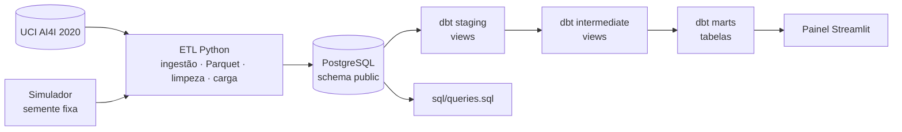
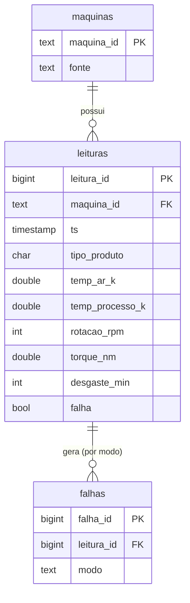

# 🏭 Pipeline de Dados Industriais


[](https://github.com/DenisPaulo/pipeline-dados-industriais/actions/workflows/ci.yml)

> **Como transformar leituras sujas de sensores em tabelas confiáveis — e depois em um painel?**
> Pipeline ETL + modelagem com **dbt** + painel Streamlit. Construído por quem vem do chão de fábrica (robôs industriais, CLP e manutenção preventiva).

> ⚠️ **Projeto educacional / de portfólio.** Os dados são sintéticos e o pipeline não foi projetado para produção (sem orquestração, monitoramento nem controle de acesso).

---

## O que é

Sensores de máquina entregam dados com falhas de verdade: células vazias, valores absurdos (temperatura em °C onde era esperado Kelvin, rotação negativa), texto no lugar de número e leituras repetidas. Este projeto mostra, de ponta a ponta, como tratar isso de forma **auditável** (nada some sem registro) e **repetível** (rodar duas vezes não duplica nada) — e, na V2, como modelar com **dbt** e visualizar num **painel**.

Duas fontes entram no pipeline:

1. **AI4I 2020**, dataset público de manutenção preditiva (10.000 registros), baixado do UCI.
2. **Leituras simuladas**: séries por máquina geradas com semente fixa, com nulos, outliers, texto inválido e duplicatas injetados de propósito para testar a limpeza.

## Fluxo (V2)



Em palavras: o **ETL Python** limpa e carrega tabelas em `public` (`maquinas`, `leituras`, `falhas`). O **dbt** cria views em `staging` e `intermediate` e tabelas finais em `marts`. O **painel** lê só os marts.

## Como rodar

Pré-requisitos: Docker com Compose v2 (no Windows: Docker Desktop). O `make` é opcional — os equivalentes `docker compose` estão abaixo.

```bash
git clone https://github.com/DenisPaulo/pipeline-dados-industriais.git
cd pipeline-dados-industriais

cp .env.example .env     # defina POSTGRES_PASSWORD (obrigatória) no .env

# 1) Banco
docker compose up -d --wait postgres

# 2) ETL Python (ingestão -> limpeza -> carga)
docker compose run --rm --build app

# 3) dbt (staging + intermediate + marts + testes)
docker compose run --rm --build dbt build

# 4) Painel (http://localhost:8501)
docker compose --profile painel up -d --build painel
```

Com `make` (Linux/macOS/WSL): `make up`, `make run`, `make dbt-build`, `make painel`.

| Comando | O que faz |
|---|---|
| `make test` / `pytest -q` | Testes rápidos: sem rede e sem PostgreSQL |
| `make test-integration` | Testes opcionais contra um PostgreSQL real |
| `make lint` | `ruff check` e `ruff format --check` |
| `make queries` | Executa `sql/queries.sql` no banco do compose |
| `make psql` | Abre um `psql` no PostgreSQL do compose |
| `make down` | Derruba os serviços (o volume do banco é mantido) |

Sem Docker, dá para rodar só até a limpeza: `PYTHONPATH=src python -m pipeline.run --sem-carga`.

## Resultado de uma execução (números reais)

Com as duas fontes e semente 42:

| Etapa | Resultado |
|---|---|
| Ingestão | 26.271 linhas (10.000 AI4I + 16.271 simuladas) em 126 partições Parquet |
| Limpeza | 24.511 válidas e **1.760 descartadas** (143 duplicadas, 1.180 sensor nulo, 154 não numéricas, 283 fora da faixa física) |
| Carga (`public`) | 18 máquinas, 24.511 leituras, 586 registros de falha (modos) |
| **dbt marts** | `dim_maquina` = 18; `fct_leituras` = 24.511; `fct_falhas_diarias` = 123 linhas (`sum(qtd_falhas)` = 556 leituras com falha) |
| **dbt build** | `PASS=60` (7 modelos + 53 testes) |
| Idempotência do ETL | segunda carga: 0 inseridas, 0 atualizadas |

A conferência da limpeza é sempre `entrada = válidas + descartadas`. Os 586 de `falhas` contam *modos*; os 556 de `houve_falha` / `qtd_falhas` contam *leituras* com falha (uma leitura pode ter vários modos).

## Modelagem com dbt

Detalhes em [`dbt/README.md`](dbt/README.md). Resumo:

| Camada | Schema | Materialização | O que faz |
|---|---|---|---|
| **staging** | `staging` | view | Nomes claros, temperaturas também em °C (`stg_maquinas`, `stg_leituras`, `stg_falhas`) |
| **intermediate** | `intermediate` | view | Leituras enriquecidas sem duplicar falhas (`int_leituras_enriquecidas`) |
| **marts** | `marts` | **table** | Tabelas finais: `dim_maquina`, `fct_leituras`, `fct_falhas_diarias` |

- Credenciais só por `POSTGRES_*` (mesmo `.env` do compose).
- Testes do dbt: `unique`, `not_null`, `relationships`, `accepted_values` e testes singulares (contagem sem perda / chave composta).
- Comando: `docker compose run --rm --build dbt build` (ou `make dbt-build`).

## Painel Streamlit

O painel lê **somente** as tabelas do schema `marts` (KPIs, falhas por máquina, falhas por dia, filtro por fonte, distribuição de modos).

```bash
# depois do dbt build:
docker compose --profile painel up -d --build painel
# abra http://localhost:8501
```

Se os marts ainda não existirem, o painel mostra um aviso pedindo para rodar o `dbt build`.

## Estrutura

```
.
├── src/pipeline/          # ETL Python (ingestão, limpeza, carga)
├── sql/                   # schema.sql + queries.sql
├── dbt/                   # V2: staging, intermediate, marts
├── painel/                # V2: app Streamlit sobre os marts
├── tests/                 # pytest
├── data/                  # raw/ e processed/ (não versionados)
├── docs/                  # guia de estudo
├── Dockerfile             # imagem do ETL
├── docker-compose.yml     # postgres, app, dbt, painel
├── Makefile
└── .env.example
```

## Modelo de dados (camada `public`)



- `leituras` tem `UNIQUE (maquina_id, ts)`: chave natural da carga idempotente.
- `falhas` tem `UNIQUE (leitura_id, modo)`; falha sem modo informado vira `DESCONHECIDO`.
- `CHECK`s espelham as faixas físicas; índices em `ts`, falhas parciais e `modo`.

Nos **marts**, o desenho é dimensional: `dim_maquina` (18 linhas) + `fct_leituras` (24.511) + `fct_falhas_diarias` (123).

## Decisões de design

- **Bruto em texto, sem corrigir nada.** A camada bruta guarda o dado como chegou. A limpeza fica auditável.
- **Particionamento por data e máquina** (`data=.../maquina_id=.../`), no estilo Hive.
- **Um motivo por linha descartada**, na ordem de prioridade — a conta fecha: `entrada = válidas + descartadas`.
- **Faixas físicas largas** (erro de sensor/unidade, não variação normal).
- **Carga idempotente** em uma transação (`COPY` + `ON CONFLICT`).
- **Credenciais só por variáveis de ambiente**; porta do banco só em `127.0.0.1`.
- **"Máquinas virtuais" no AI4I** (decisão didática; ver [`data/README.md`](data/README.md)).
- **dbt em camadas** (staging → intermediate → marts); marts materializados como tabela.
- **Painel só lê marts** (não consulta `public` nem staging).

## Consultas SQL de exemplo

[`sql/queries.sql`](sql/queries.sql): CTEs e window functions (ranking de máquinas, média móvel, `LAG`, `NTILE`, falhas acumuladas). Nos marts:

```sql
SELECT id_maquina, fonte, total_leituras, total_falhas
FROM marts.dim_maquina ORDER BY total_falhas DESC;

SELECT count(*) AS n_dias_maquina, sum(qtd_falhas) AS soma_falhas
FROM marts.fct_falhas_diarias;
```

## O que foi verificado

- `ruff` + 31 testes rápidos e 3 de integração (CI).
- Pipeline ponta a ponta (Postgres local e Docker no Windows / Docker Desktop WSL 2) com os números da tabela acima.
- `dbt build` com `PASS=60` (local e via `docker compose run --rm --build dbt`).
- Painel: ver seção "Painel Streamlit" e o CI.

## Roadmap

- **V2 (feito):** modelagem com **dbt** (staging, intermediate, marts + testes) e **painel** Streamlit sobre os marts.
- **V3:** orquestração com **Airflow** e execução em **nuvem** (armazenamento de objetos para o Parquet e banco gerenciado).

## Fonte dos dados

AI4I 2020 Predictive Maintenance Dataset, UCI Machine Learning Repository, licença CC BY 4.0.

> AI4I 2020 Predictive Maintenance Dataset [Dataset]. (2020). UCI Machine Learning Repository. https://doi.org/10.24432/C5HS5C

Citação e artigo introdutório em [`data/README.md`](data/README.md).

## Projeto relacionado

[manutencao-preditiva-ia](https://github.com/DenisPaulo/manutencao-preditiva-ia): modelo de classificação de falhas com explicabilidade (XGBoost + SHAP) sobre o mesmo dataset.

## Licença

[MIT](LICENSE). Os dados do AI4I seguem a licença CC BY 4.0 indicada acima.
