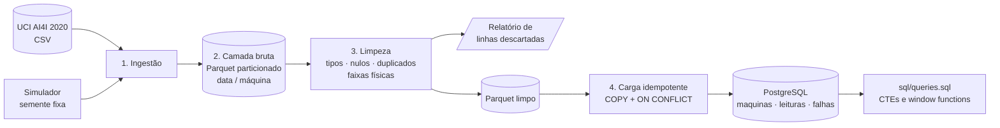
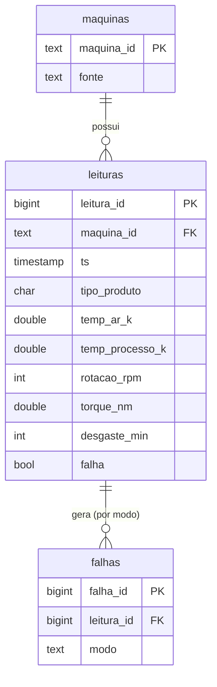

# 🏭 Pipeline de Dados Industriais


[](https://github.com/DenisPaulo/pipeline-dados-industriais/actions/workflows/ci.yml)

> **Como transformar leituras sujas de sensores em tabelas confiáveis para análise?**
> Um pipeline ETL didático: ingestão, camada bruta em Parquet, limpeza com relatório do que foi descartado e carga idempotente em PostgreSQL. Construído por quem vem do chão de fábrica (robôs industriais, CLP e manutenção preventiva).

> ⚠️ **Projeto educacional / de portfólio.** Os dados são sintéticos e o pipeline não foi projetado para produção (sem orquestração, monitoramento nem controle de acesso).

---

## O que é

Sensores de máquina entregam dados com falhas de verdade: células vazias, valores absurdos (temperatura em °C onde era esperado Kelvin, rotação negativa), texto no lugar de número e leituras repetidas. Este projeto mostra, de ponta a ponta, como tratar isso de forma **auditável** (nada some sem registro) e **repetível** (rodar duas vezes não duplica nada).

Duas fontes entram no pipeline:

1. **AI4I 2020**, dataset público de manutenção preditiva (10.000 registros), baixado do UCI.
2. **Leituras simuladas**: séries por máquina geradas com semente fixa, com nulos, outliers, texto inválido e duplicatas injetados de propósito para testar a limpeza.

## Fluxo



## Como rodar

Pré-requisitos: Docker com Compose v2 e `make`.

```bash
git clone https://github.com/DenisPaulo/pipeline-dados-industriais.git
cd pipeline-dados-industriais

cp .env.example .env     # defina POSTGRES_PASSWORD (obrigatória) no .env
make up                  # sobe o PostgreSQL 16 e espera ficar saudável
make run                 # constrói a imagem e roda ingestão -> limpeza -> carga
make queries             # executa os exemplos de sql/queries.sql
```

Equivalente sem `make`: `docker compose up -d --wait postgres` e `docker compose run --rm --build app`.

Outros comandos:

| Comando | O que faz |
|---|---|
| `make test` | Testes rápidos (pytest): sem rede e sem PostgreSQL |
| `make test-integration` | Testes opcionais contra um PostgreSQL real (`POSTGRES_*` no ambiente) |
| `make lint` | `ruff check` e `ruff format --check` |
| `make psql` | Abre um `psql` no banco do compose |
| `make run-local` | Roda o pipeline no host (precisa de Python 3.12 e das variáveis `POSTGRES_*`) |
| `make down` | Derruba os serviços (o volume do banco é mantido) |

Sem Docker, é possível rodar só até a limpeza (não precisa de banco): `PYTHONPATH=src python -m pipeline.run --sem-carga`.

## Resultado de uma execução

Execução real, com as duas fontes e semente 42 (PostgreSQL 17 local, sem Docker; veja a seção "O que foi verificado"):

| Etapa | Resultado |
|---|---|
| Ingestão | 26.271 linhas (10.000 AI4I + 16.271 simuladas) em 126 partições Parquet |
| Limpeza | 24.511 válidas e **1.760 descartadas** (143 duplicadas, 1.180 com sensor nulo, 154 não numéricas, 283 fora da faixa física) |
| Carga | 18 máquinas, 24.511 leituras, 586 registros de falha |
| Tempo | ~3,7 s na primeira execução (inclui o download); ~1,3 s nas seguintes |
| Idempotência | segunda execução: 0 linhas inseridas, 0 atualizadas, totais inalterados |

Nas leituras simuladas, 16.128 linhas-base + 143 duplicatas injetadas = 16.271; a limpeza descarta 1.760 linhas (os 143 duplicados e as linhas com algum sensor nulo, inválido ou fora da faixa). Os números podem variar um pouco se o UCI alterar o arquivo; a conferência é sempre `entrada = válidas + descartadas`, validada no código.

## Estrutura

```
.
├── src/pipeline/
│   ├── ingest.py      # baixa o AI4I, lê as fontes e grava a camada bruta (Parquet particionado)
│   ├── simulador.py   # gerador de leituras simuladas (semente fixa, com problemas injetados)
│   ├── clean.py       # limpeza: tipos, duplicados, nulos, faixas físicas + relatório
│   ├── load.py        # carga idempotente no PostgreSQL (COPY + ON CONFLICT)
│   ├── run.py         # orquestra as etapas (python -m pipeline.run)
│   ├── config.py      # configuração só por variáveis de ambiente
│   └── schemas.py     # colunas, modos de falha e faixas físicas
├── sql/
│   ├── schema.sql     # tabelas, chaves, constraints e índices
│   └── queries.sql    # exemplos com CTEs e window functions
├── tests/             # pytest com dados sintéticos pequenos
├── data/              # raw/ (ignorado), processed/ e README dos dados
├── Dockerfile
├── docker-compose.yml # serviços: postgres (16) e app (Python)
├── Makefile
└── .env.example       # placeholders; o .env real nunca é versionado
```

## Modelo de dados



- `leituras` tem `UNIQUE (maquina_id, ts)`: a chave natural que sustenta a carga idempotente.
- `falhas` tem `UNIQUE (leitura_id, modo)`: uma leitura com falha pode ter mais de um modo (`TWF`, `HDF`, `PWF`, `OSF`, `RNF`); falha sem modo informado vira `DESCONHECIDO`.
- `CHECK`s espelham as faixas físicas válidas, então o banco também recusa valores absurdos.
- Índices: `leituras(ts)`, parcial em `leituras(maquina_id, ts) WHERE falha`, e `falhas(modo)`.

## Decisões de design

- **Bruto em texto, sem corrigir nada.** A camada bruta guarda o dado como chegou (inclusive `ERRO` e nulos). A limpeza fica reproduzível e auditável: dá para reprocessar sem baixar de novo.
- **Particionamento por data e máquina** (`data=.../maquina_id=.../`), no estilo Hive: leituras seletivas por dia ou por máquina e fácil de evoluir para um data lake.
- **Cada linha descartada tem exatamente um motivo**, na ordem de prioridade (duplicada, máquina ausente, timestamp inválido, tipo inválido, falha inválida, sensor nulo, não numérico, fora da faixa física). Isso fecha a conta: `entrada = válidas + descartadas`. O detalhe fica em `data/processed/relatorio.json` e as linhas em `descartadas.parquet`.
- **Faixas físicas largas de propósito.** Elas pegam erro de sensor ou de unidade, não variação normal do processo. Descartar um valor legítimo e raro seria pior do que deixá-lo passar.
- **Carga idempotente em uma transação:** `COPY` para tabelas temporárias e `INSERT ... ON CONFLICT` nas finais (atualiza só o que mudou). Se algo falhar, nada é gravado.
- **Credenciais só por variáveis de ambiente.** O `docker-compose.yml` lê do `.env` e se recusa a subir sem `POSTGRES_PASSWORD`; a porta do banco só é exposta em `127.0.0.1`.
- **"Máquinas virtuais" no AI4I.** O dataset original não tem máquina nem horário; o pipeline os atribui de forma determinística e documentada (ver [`data/README.md`](data/README.md)).
- **Testes sem rede e sem PostgreSQL.** A limpeza, a ingestão e a serialização da carga são testadas com dados sintéticos pequenos; os testes com banco real são marcados `integration` e opcionais (o CI os executa num serviço PostgreSQL efêmero).

## Consultas de exemplo

[`sql/queries.sql`](sql/queries.sql) traz consultas com CTEs e window functions: taxa de falha por fonte e tipo de produto, **ranking de máquinas por falhas** (`RANK`), **média móvel** da temperatura (`AVG ... ROWS BETWEEN`), variação entre leituras (`LAG`), modos de falha por máquina (`ROW_NUMBER`), tempo entre falhas, quartis de desgaste (`NTILE`) e falhas acumuladas por dia.

## O que foi verificado

- `ruff` (lint e formatação) e 31 testes rápidos: passam localmente e no CI.
- 3 testes de integração (idempotência, reprocessamento com atualização, rollback por constraint) passam contra PostgreSQL real, localmente e no CI.
- Pipeline ponta a ponta contra um PostgreSQL 17 local, executado duas vezes (a segunda não altera nada) e todas as consultas de `sql/queries.sql` executadas sem erro.
- **Docker testado no Windows (Docker Desktop, WSL 2):** `docker compose up -d` (PostgreSQL 16 saudável) e `docker compose run --rm --build app` rodaram de ponta a ponta com os mesmos números da execução local (26.271 linhas lidas, 24.511 válidas, 1.760 descartadas, 18 máquinas, 24.511 leituras, 586 falhas), e `SELECT count(*) FROM leituras;` retornou 24511. O alvo `make` não foi testado no Windows; use os comandos equivalentes `docker compose` da seção de execução.

## Roadmap

- **V2:** modelagem com **dbt**, testes de **qualidade de dados** (contratos de esquema, expectativas por coluna) e um **painel** para acompanhar sensores, falhas e qualidade.
- **V3:** orquestração com **Airflow** e execução em **nuvem** (armazenamento de objetos para o Parquet e banco gerenciado).

## Fonte dos dados

AI4I 2020 Predictive Maintenance Dataset, UCI Machine Learning Repository, licença CC BY 4.0.

> AI4I 2020 Predictive Maintenance Dataset [Dataset]. (2020). UCI Machine Learning Repository. https://doi.org/10.24432/C5HS5C

Autor: Stephan Matzka. Detalhes e artigo introdutório em [`data/README.md`](data/README.md).

## Projeto relacionado

[manutencao-preditiva-ia](https://github.com/DenisPaulo/manutencao-preditiva-ia): modelo de classificação de falhas com explicabilidade (XGBoost + SHAP) sobre o mesmo dataset.

## Licença

[MIT](LICENSE). Os dados do AI4I seguem a licença CC BY 4.0 indicada acima.
