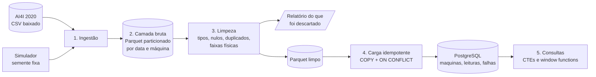
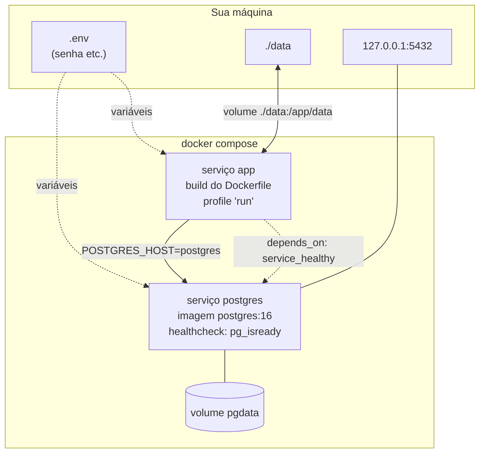
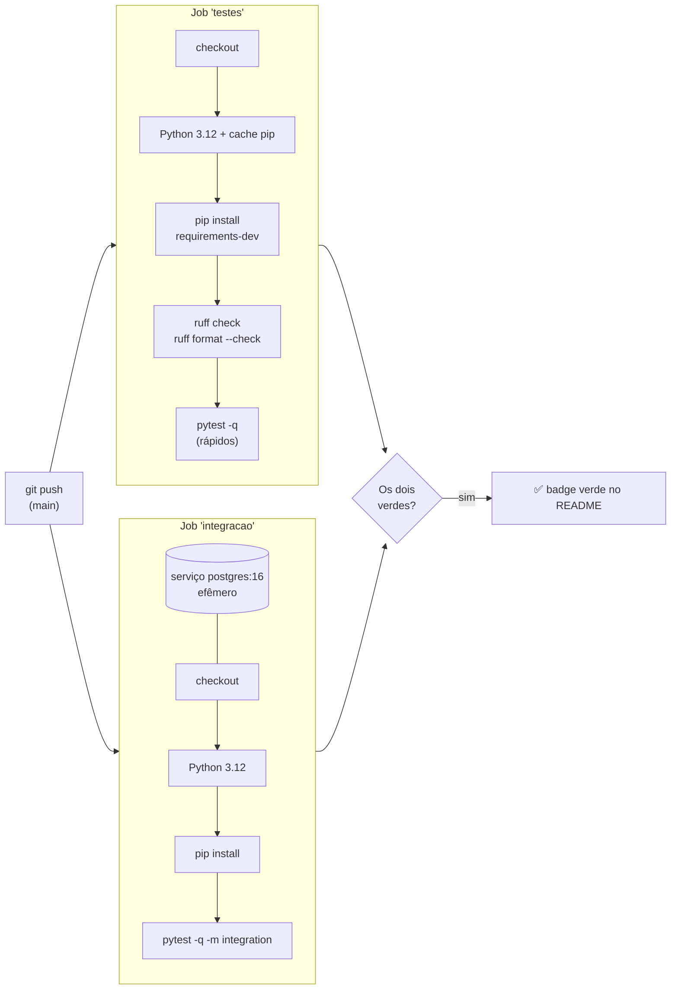
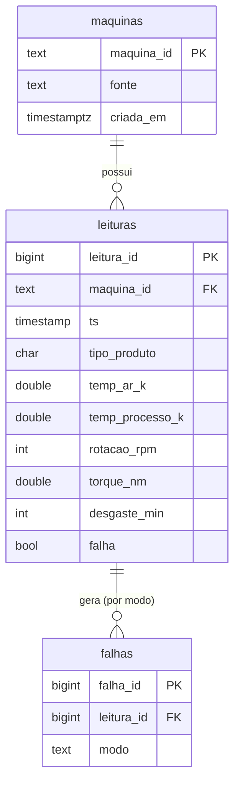

# 📘 Guia de Estudo: Pipeline de Dados Industriais

> Guia para quem vem da automação industrial (CLP, robôs, manutenção) e está começando em Engenharia de Dados, com Docker, SQL e Python para dados.
> Tudo aqui foi conferido no código real do repositório. Quando um número aparece (linhas, tempos, contagens), ele vem de uma execução real, e eu digo de qual.

**Como usar este guia:** leia na ordem pelo menos uma vez. Depois abra os arquivos citados ao lado do guia e faça os exercícios da seção 9. Aprender dados é 30% ler e 70% rodar e quebrar de propósito.

## Índice

1. [Visão geral e o problema que resolve](#1-visão-geral-e-o-problema-que-resolve)
2. [Mapa de pastas e arquivos](#2-mapa-de-pastas-e-arquivos)
3. [O fluxo ponta a ponta, com código](#3-o-fluxo-ponta-a-ponta-com-código)
4. [Glossário](#4-glossário)
5. [Docker, Compose, Dockerfile e .env](#5-docker-compose-dockerfile-e-env)
6. [Testes e CI](#6-testes-e-ci)
7. [O SQL: schema e consultas](#7-o-sql-schema-e-consultas)
8. [Cronologia do que foi feito](#8-cronologia-do-que-foi-feito)
9. [Exercícios e autoavaliação](#9-exercícios-e-autoavaliação)
10. [O que cada parte ensina e o que vem na V2/V3](#10-o-que-cada-parte-ensina-e-o-que-vem-na-v2v3)

---

## 1. Visão geral e o problema que resolve

### A analogia da fábrica

Pense numa linha de produção com vários sensores (temperatura, rotação, torque, desgaste da ferramenta). Na planta, o CLP lê os sinais e você vê os valores em tempo real. Agora imagine querer responder perguntas como *"qual máquina falhou mais no mês?"* ou *"a falha acontece mais quando a ferramenta está muito gasta?"*. Para isso, os valores precisam estar **guardados, organizados e confiáveis**, e é aí que entra a Engenharia de Dados.

Só que sensor real erra: o cabo solta e a leitura vem vazia, o sensor satura e marca 999, alguém configura a unidade errada e a temperatura chega em °C quando se esperava Kelvin, o sistema reenvia a mesma leitura duas vezes. Se você jogar isso direto numa análise, os resultados ficam errados sem que ninguém perceba.

### O que o projeto faz, literalmente

Este repositório é um **pipeline ETL**: um programa em Python que, quando você manda rodar:

1. **Pega** dados de duas fontes: um dataset público de manutenção preditiva (AI4I 2020) e leituras de sensores **simuladas** por um gerador do próprio projeto (com defeitos injetados de propósito).
2. **Guarda uma cópia fiel** dos dados como chegaram, em arquivos Parquet organizados por data e máquina (a "camada bruta").
3. **Limpa**: converte tipos, remove duplicadas, nulos, texto onde devia ser número e valores fisicamente impossíveis. Para cada linha descartada, registra o motivo.
4. **Carrega** o resultado num banco PostgreSQL, em tabelas organizadas (`maquinas`, `leituras`, `falhas`), de forma que rodar de novo **não duplica** nada.
5. Deixa prontas **consultas SQL** de exemplo que respondem perguntas de negócio.

Tudo isso roda com Docker, então você não precisa instalar o PostgreSQL à mão.

> ⚠️ É um projeto **educacional**. Os dados são sintéticos. Não há orquestração, monitoramento nem controle de acesso, como seria necessário em produção.

### Visão geral em um diagrama



---

## 2. Mapa de pastas e arquivos

```
pipeline-dados-industriais/
├── src/pipeline/          ← o código Python (o "pipeline" em si)
│   ├── schemas.py         ← nomes das colunas, modos de falha, faixas físicas válidas
│   ├── config.py          ← lê as configurações das variáveis de ambiente
│   ├── simulador.py       ← gera leituras simuladas (com defeitos injetados)
│   ├── ingest.py          ← baixa o AI4I, junta as fontes, grava o Parquet bruto
│   ├── clean.py           ← limpeza + relatório de descartes
│   ├── load.py            ← carrega no PostgreSQL de forma idempotente
│   ├── run.py             ← orquestra: ingestão → limpeza → carga
│   └── __main__.py        ← permite rodar com `python -m pipeline`
├── sql/
│   ├── schema.sql         ← cria as tabelas, chaves, constraints e índices
│   └── queries.sql        ← 8 consultas de exemplo
├── tests/                 ← testes automáticos (pytest)
├── data/
│   ├── README.md          ← explica as fontes de dados e a citação
│   ├── raw/               ← dados baixados/gerados (NÃO vai pro Git)
│   └── processed/         ← Parquet bruto, Parquet limpo, relatório (NÃO vai pro Git)
├── docs/GUIA_DE_ESTUDO.md ← este arquivo
├── Dockerfile             ← receita da imagem do app Python
├── docker-compose.yml     ← descreve os serviços: postgres e app
├── Makefile               ← atalhos: make up, make run, make test, make lint
├── .env.example           ← modelo das variáveis (com placeholders)
├── .github/workflows/ci.yml ← o CI (GitHub Actions)
├── pyproject.toml         ← configuração do ruff e do pytest
├── requirements.txt       ← dependências para rodar
├── requirements-dev.txt   ← + pytest e ruff, para desenvolver
├── .gitignore / .dockerignore ← o que o Git / o Docker devem ignorar
└── LICENSE, SECURITY.md, CONTRIBUTING.md, README.md
```

### Arquivos de "apoio" que costumam confundir

| Arquivo | Para que serve |
|---|---|
| `requirements.txt` | Lista as bibliotecas Python com versão fixa: `pandas`, `pyarrow` (Parquet) e `psycopg2-binary` (conversar com o PostgreSQL). Versões fixas = ambiente reproduzível. |
| `requirements-dev.txt` | Começa com `-r requirements.txt` (inclui tudo de lá) e adiciona `pytest` e `ruff`. Só quem desenvolve precisa. |
| `pyproject.toml` | Configura o `ruff` (tamanho de linha 110, regras `E, W, F, I, B, UP`) e o `pytest` (onde estão os testes, e que por padrão **não** roda os testes marcados como `integration`). |
| `.gitignore` | Impede de versionar dados (`data/raw/`, `*.csv`, `*.parquet`) e segredos (`.env`). |
| `.dockerignore` | Impede de copiar para dentro da imagem coisas inúteis ou perigosas (`.git`, `.env`, dados, testes). |
| `data/processed/.gitkeep` | Arquivo vazio só para o Git guardar a pasta (o Git não versiona pastas vazias). |

---

## 3. O fluxo ponta a ponta, com código

O ponto de entrada é `src/pipeline/run.py`. Rode com `python -m pipeline.run`.

```python
# src/pipeline/run.py (resumo da função executar)
bruto = ingest.ingerir(cfg)                      # 1. ingestão + grava Parquet bruto
bruto = ingest.ler_bruto(cfg.bruto_dir)          # lê de volta do disco
leituras, falhas, descartadas, rel = clean.limpar(bruto)   # 2. limpeza
clean.gravar_limpo(...)                          # grava Parquet limpo + relatorio.json
conn = load.conectar(cfg)                        # 3. conecta no PostgreSQL
load.aplicar_schema(conn, cfg.sql_dir / "schema.sql")
mudancas = load.carregar(conn, leituras, falhas) # carga idempotente
```

**Ponto-chave:** a limpeza parte do que foi **lido do disco** (a camada bruta), não da memória. Isso garante que o Parquet bruto é, de fato, a fonte da verdade da etapa seguinte.

Com `--sem-carga` o pipeline para depois da limpeza e não precisa de banco: `PYTHONPATH=src python -m pipeline.run --sem-carga`.

### 3.0 Configuração: `config.py`

Nenhuma senha está no código. Tudo vem de **variáveis de ambiente**:

```python
db_senha=env.get("POSTGRES_PASSWORD") or None,
db_host=env.get("POSTGRES_HOST", "localhost"),
```

- `env.get("NOME", "padrao")` lê a variável `NOME`; se ela não existir, usa `"padrao"`.
- Para a senha não há padrão: se faltar, `conexao_kwargs()` levanta um erro claro (`POSTGRES_PASSWORD não definido...`). Preferir falhar alto a conectar com uma senha adivinhada.
- `Config` é uma `dataclass(frozen=True)`: um "pacote de configurações" imutável. Propriedades como `bruto_dir` calculam os caminhos (`data/processed/bruto`).

### 3.1 Esquema compartilhado: `schemas.py`

É o "contrato" entre as etapas. Alguns itens reais:

```python
SENSORES = ["temp_ar_k", "temp_processo_k", "rotacao_rpm", "torque_nm", "desgaste_min"]
MODOS_FALHA = ["TWF", "HDF", "PWF", "OSF", "RNF"]
FAIXAS_FISICAS = {"temp_ar_k": (250.0, 350.0), "rotacao_rpm": (0.0, 10_000.0), ...}
```

As **faixas físicas** são largas de propósito: servem para pegar *erro* (sensor saturado, unidade errada), não variação normal do processo. O `schema.sql` repete essas mesmas faixas em `CHECK`s, e um teste confere que elas batem (veja seção 6).

Os 5 modos de falha vêm do dataset AI4I: `TWF` (desgaste da ferramenta), `HDF` (dissipação de calor), `PWF` (potência), `OSF` (sobrecarga), `RNF` (aleatória).

### 3.2 O simulador: `simulador.py`

Gera uma série temporal por máquina (`SIM-01` … `SIM-08`) e **depois sujeita os dados**, para a limpeza ter o que limpar.

- **Semente fixa:** `rng = np.random.default_rng(semente)`. Mesma semente ⇒ exatamente os mesmos números. É o que torna o projeto reproduzível e testável. Padrão: 42 (`PIPELINE_SEMENTE`).
- **Série por máquina:** ciclo diário de temperatura (seno), ruído, desgaste da ferramenta que sobe e é "trocada" ao atingir um limite, e falhas calculadas por regras físicas simplificadas (por exemplo `pwf = (potencia < 3500) | (potencia > 9000)`).
- **Defeitos injetados**, com probabilidades definidas no topo do arquivo:

```python
P_NULO = 0.015       # 1,5% das células de sensor viram nulo
P_OUTLIER = 0.004    # 0,4% viram valor absurdo (0, 999.9, °C no lugar de K...)
P_LIXO = 0.002       # 0,2% viram o texto "ERRO"
P_DUPLICADA = 0.01   # 1% das linhas são repetidas no fim
```

Na execução de referência (semente 42), o simulador gerou 16.128 linhas-base + 143 duplicadas = 16.271 linhas.

Tudo sai como **texto** (`dtype object`), de propósito: a camada bruta não deve "consertar" nada.

### 3.3 Ingestão: `ingest.py`

**a) Baixar o AI4I (idempotente).** Se o CSV já existe, não baixa de novo:

```python
if csv_path.exists() and not forcar:
    print(f"[ingestão] {csv_path.name} já existe — download ignorado.")
    return csv_path
```

O download escreve num arquivo `.csv.tmp` e só depois renomeia (`tmp.replace(csv_path)`). Assim, se cair a conexão no meio, não sobra um CSV pela metade.

**b) Adaptar o AI4I ao nosso modelo.** O AI4I não tem coluna de máquina nem horário. O pipeline *inventa* de forma determinística e documentada:

```python
passo = (udi - 1) // AI4I_MAQUINAS_VIRTUAIS     # 10 máquinas virtuais
ts = AI4I_INICIO + pd.to_timedelta(passo * AI4I_INTERVALO_MIN, unit="min")
maq = (udi - 1) % AI4I_MAQUINAS_VIRTUAIS + 1
```

O registro 1 vai para `AI4I-01`, o 2 para `AI4I-02`, …, o 11 volta para `AI4I-01` dez minutos depois. **Isto não tem significado físico**: é só um truque didático para ter "séries por máquina" também nessa fonte. Por isso, analisar "a máquina AI4I-10" não diz nada sobre uma máquina real.

**c) Gravar o Parquet particionado:**

```python
out["data"] = out["timestamp"].str.slice(0, 10).fillna(PARTICAO_SEM_DATA)   # "2026-01-01"
...
pq.write_to_dataset(tabela, root_path=str(bruto_dir),
                    partition_cols=["data", "maquina_id"], ...)
```

Resultado em disco (estilo Hive):

```
data/processed/bruto/
└── data=2026-01-01/
    ├── maquina_id=SIM-01/parte-0.parquet
    └── maquina_id=SIM-02/parte-0.parquet
```

- A pasta inteira é apagada e recriada a cada execução (`shutil.rmtree`), então o resultado é sempre determinístico.
- Linhas com data inválida ou máquina vazia vão para as partições `sem_data` / `sem_maquina`, em vez de sumirem. Nada é perdido na camada bruta.
- Na execução de referência: 26.271 linhas em 126 partições (10 máquinas AI4I × 7 dias + 8 simuladas × 7 dias).

### 3.4 Limpeza: `clean.py` (o coração do projeto)

A função `limpar(bruto)` devolve **quatro** coisas: `leituras` (válidas, com tipos corretos), `falhas` (uma linha por modo de falha), `descartadas` (com a coluna `motivo`) e `relatorio` (contagens).

**Passo 1: medir problemas sem apagar nada.** Cada problema vira uma "máscara" (série de verdadeiro/falso, uma posição por linha):

```python
ts = pd.to_datetime(df["timestamp"], format="%Y-%m-%d %H:%M:%S", errors="coerce")
num = {c: pd.to_numeric(df[c], errors="coerce") for c in SENSORES}
masc = {
    "duplicada": df.duplicated(subset=CHAVE, keep="first") & ...,
    "maquina_ausente": _vazio(df["maquina_id"]),
    "timestamp_invalido": ts.isna(),
    ...
}
```

- `errors="coerce"` significa: "se não der para converter, vire nulo (`NaT`/`NaN`) em vez de dar erro". Assim, `"ERRO"` vira `NaN` e conseguimos detectá-lo.
- `duplicated(subset=CHAVE, keep="first")`: marca como duplicada toda repetição da chave (`fonte`, `maquina_id`, `timestamp`) **a partir da segunda**. A primeira é mantida.

**Passo 2: um motivo por linha.** Uma linha pode ter vários problemas ao mesmo tempo. Para a conta fechar, só vale o *primeiro* na ordem de prioridade:

```python
motivo = pd.Series(pd.NA, index=df.index, dtype="string")
for nome in MOTIVOS:
    motivo = motivo.mask(motivo.isna() & masc[nome], nome)
```

`mask(condição, valor)` troca o valor onde a condição é verdadeira. A condição `motivo.isna() & masc[nome]` quer dizer: "ainda sem motivo **e** tem este problema". Resultado: cada linha descartada tem exatamente um motivo.

**Passo 3: tipos corretos nas linhas válidas.** `rotacao_rpm` e `desgaste_min` viram `int64`, os demais sensores `float64`, `falha` vira booleano, `ts` vira `datetime`.

**Passo 4: tabela de falhas.** Uma leitura com falha pode ter mais de um modo (`"HDF|PWF"`). O código separa pelo `|` e usa `explode` para virar uma linha por modo. Se a falha não informa modo, vira `DESCONHECIDO`.

**Passo 5: a prova real.** No fim há uma checagem que quebra o programa se a conta não fechar:

```python
assert relatorio["linhas_validas"] + relatorio["linhas_descartadas"] == n_entrada
```

**Resultado real (semente 42, as duas fontes):**

| Item | Linhas |
|---|---|
| Entrada | 26.271 |
| Válidas | 24.511 |
| Descartadas | 1.760 |
| ↳ duplicada | 143 |
| ↳ sensor_nulo | 1.180 |
| ↳ sensor_nao_numerico | 154 |
| ↳ fora_da_faixa_fisica | 283 |

Das 10.000 linhas do AI4I, todas passaram; os descartes vieram do simulado (16.271 → 14.511).

### 3.5 Carga idempotente: `load.py`

**Idempotente** = rodar uma, duas ou dez vezes dá o **mesmo estado final**. Na prática: reprocessar não duplica linhas.

A estratégia tem 4 ideias:

1. **Staging (tabelas temporárias):** os dados entram primeiro em tabelas temporárias `stg_leituras` e `stg_falhas`, criadas com `ON COMMIT DROP` (somem sozinhas no fim da transação).
2. **`COPY`:** é o jeito rápido do PostgreSQL de carregar muitos dados de uma vez (muito mais rápido que milhares de `INSERT`). O código serializa o DataFrame em CSV na memória (`para_csv`) e entrega ao `copy_expert`.
3. **`INSERT ... ON CONFLICT`:** do staging para as tabelas finais.

```sql
INSERT INTO leituras (maquina_id, ts, ...)
SELECT maquina_id, ts, ... FROM stg_leituras
ON CONFLICT (maquina_id, ts) DO UPDATE SET torque_nm = EXCLUDED.torque_nm, ...
WHERE (leituras.tipo_produto, ...) IS DISTINCT FROM (EXCLUDED.tipo_produto, ...)
```

   - `ON CONFLICT (maquina_id, ts)`: "se já existe uma leitura dessa máquina nesse instante...".
   - `DO UPDATE ... WHERE ... IS DISTINCT FROM`: "...atualize, mas **só se algum valor mudou**". Se nada mudou, a linha nem é tocada. Por isso, na segunda execução, o relatório mostra `leituras_inseridas: 0` e `leituras_atualizadas: 0`.
   - `EXCLUDED` é o nome especial da linha que *tentou* entrar.
   - `RETURNING (xmax = 0) AS inserida`: truque do PostgreSQL para distinguir linhas realmente inseridas (`xmax = 0`) das atualizadas, e assim contar cada uma.
4. **Tudo numa transação:** se qualquer passo falhar, o `except` faz `conn.rollback()` e **nada** é gravado. Não existe "metade carregado".

Além disso, `SQL_FALHAS_REMOVER` apaga do banco falhas que deixaram de existir nos dados reprocessados (por exemplo, uma correção que removeu um modo de falha).

**`conectar()` tem retentativas:** tenta até 30 vezes, esperando 2 s entre elas. Servidor de banco recém-iniciado demora a aceitar conexões; o pipeline espera em vez de quebrar.

**Resultado real da carga (semente 42):**

| | 1ª execução | 2ª execução |
|---|---|---|
| máquinas novas | 18 | 0 |
| leituras inseridas | 24.511 | 0 |
| falhas inseridas | 586 | 0 |
| totais no banco | 18 / 24.511 / 586 | 18 / 24.511 / 586 |

### 3.6 Consultas

Com os dados no banco, `sql/queries.sql` responde perguntas de negócio. Veja a [seção 7](#7-o-sql-schema-e-consultas).

---

## 4. Glossário

| Termo | Explicação simples | Onde aparece aqui |
|---|---|---|
| **ETL** | *Extract, Transform, Load*: extrair dados da fonte, transformar (limpar/padronizar) e carregar no destino. | Todo o `src/pipeline/` |
| **Pipeline** | Cadeia de etapas em que a saída de uma é a entrada da próxima. | `run.py` |
| **Camada bruta (raw)** | Cópia fiel do que chegou, sem correções. Serve para reprocessar e auditar. | `data/processed/bruto/` |
| **Parquet** | Formato de arquivo **colunar** e compactado, muito usado em dados. Guarda os tipos das colunas e é eficiente para ler só algumas colunas. CSV é texto puro, sem tipos. | `*.parquet` |
| **Partição** | Divisão dos dados em pastas por um critério (aqui: data e máquina). Quem lê só um dia ou uma máquina abre só aquelas pastas. | `data=.../maquina_id=.../` |
| **DataFrame** | Tabela em memória do `pandas` (linhas × colunas). | Todo o código |
| **Semente (seed)** | Número que inicializa o gerador aleatório. Mesma semente = mesmos números. | `simulador.py` |
| **Outlier** | Valor muito fora do normal (pode ser erro de sensor ou evento real). | Simulador / limpeza |
| **Idempotência** | Repetir a operação não muda o resultado além da primeira vez. | `load.py` |
| **Upsert** | *Update or Insert*: insere, e se já existir, atualiza. No PostgreSQL: `INSERT ... ON CONFLICT`. | `SQL_LEITURAS` |
| **Chave primária (PK)** | Coluna(s) que identificam cada linha de forma única. | `maquina_id`, `leitura_id` |
| **Chave estrangeira (FK)** | Coluna que aponta para a PK de outra tabela e garante que a referência existe. | `leituras.maquina_id` → `maquinas` |
| **Constraint** | Regra que o **banco** impõe: `PRIMARY KEY`, `UNIQUE`, `NOT NULL`, `CHECK`, `FOREIGN KEY`. Dado que viola a regra é recusado. | `schema.sql` |
| **Índice** | Estrutura auxiliar que acelera buscas, como o índice de um manual. | `CREATE INDEX` |
| **Transação** | Grupo de operações que acontece por inteiro ou não acontece (`commit` / `rollback`). | `carregar()` |
| **Normalização** | Separar os dados em tabelas sem repetição (máquina numa tabela, leituras em outra). | `maquinas` / `leituras` / `falhas` |
| **CTE** | `WITH nome AS (...)`: consulta nomeada, que deixa o SQL legível. | `queries.sql` |
| **Window function** | Função que calcula sobre uma "janela" de linhas relacionadas **sem** juntá-las em uma só (`RANK`, `LAG`, `AVG ... OVER`). | `queries.sql` |
| **Imagem Docker** | "Molde" congelado: sistema + Python + dependências + seu código. Não executa; é só a receita pronta. | `Dockerfile` |
| **Container** | Imagem **em execução**: um processo isolado. Imagem está para container como programa instalado está para programa aberto. | `docker compose run` |
| **Dockerfile** | Texto com os passos para construir uma imagem. | `Dockerfile` |
| **Docker Compose** | Ferramenta que descreve e sobe **vários** containers juntos (aqui: banco e app) com um arquivo YAML. | `docker-compose.yml` |
| **Volume** | Armazenamento que sobrevive ao container. Sem volume, apagar o container apaga os dados. | `pgdata`, `./data:/app/data` |
| **Healthcheck** | Comando que o Docker roda para saber se o serviço está *pronto* (não só "ligado"). | `pg_isready` no compose |
| **Variável de ambiente** | Par `NOME=valor` que o sistema entrega ao programa. Evita colocar segredos no código. | `os.environ` / `.env` |
| **`.env`** | Arquivo local com variáveis (ex.: a senha). **Nunca vai pro Git.** O repositório traz só o `.env.example`. | `.env.example` |
| **Lint** | Análise automática do código que aponta erros e estilo ruim sem executá-lo. A ferramenta usada é o **ruff**. | `make lint` |
| **pytest** | Ferramenta para escrever e rodar testes automáticos em Python. | `tests/` |
| **Fixture** | Preparação reutilizável para testes (dados de exemplo, conexão). | `conftest.py` |
| **CI** | *Integração Contínua*: a cada `push`, um servidor roda lint e testes sozinho. | `.github/workflows/ci.yml` |
| **Makefile** | Arquivo de atalhos para comandos longos (`make test`). | `Makefile` |

---

## 5. Docker, Compose, Dockerfile e .env

### 5.1 Por que Docker?

Sem Docker, cada pessoa precisaria instalar o PostgreSQL na versão certa, configurar usuário e senha e torcer para o Python bater. Com Docker, o "ambiente" vira código: você sobe tudo com um comando, igual para todo mundo. É como entregar a máquina já montada e parametrizada, em vez do manual de montagem.

### 5.2 O `Dockerfile` (como construir a imagem do app)

```dockerfile
FROM python:3.12-slim                 # parte de uma imagem pronta com Python 3.12
ENV PYTHONDONTWRITEBYTECODE=1 \
    PYTHONUNBUFFERED=1 \              # logs saem na hora, sem ficar presos em buffer
    PYTHONPATH=/app/src               # para o Python achar o pacote `pipeline`
WORKDIR /app
COPY requirements.txt .
RUN pip install --no-cache-dir -r requirements.txt   # instala dependências
COPY src ./src
COPY sql ./sql
RUN useradd --create-home --uid 1000 pipeline && mkdir -p /app/data && chown -R pipeline /app/data
USER pipeline                         # roda sem privilégios de administrador
CMD ["python", "-m", "pipeline.run"]  # comando padrão ao iniciar o container
```

Detalhes que valem a pena entender:

- **Ordem importa (cache de camadas):** `requirements.txt` é copiado e instalado **antes** do código. O Docker guarda cada passo em cache; se você só mudar o código, ele reaproveita a camada pesada do `pip install`.
- **`USER pipeline`:** boa prática de segurança, porque o app não precisa ser administrador.
- O `.dockerignore` mantém `.env`, dados e testes fora da imagem.

### 5.3 O `docker-compose.yml` (os dois serviços)



Os pontos-chave, linha a linha:

```yaml
POSTGRES_PASSWORD: ${POSTGRES_PASSWORD:?defina POSTGRES_PASSWORD no arquivo .env}
```
- `${VAR:?mensagem}`: lê `VAR` do `.env`; **se não existir, o compose para** e mostra a mensagem. É uma trava de segurança: não sobe banco sem senha.
- `${VAR:-padrao}` (usado em `POSTGRES_DB`, `POSTGRES_USER`) é o oposto: usa `padrao` se a variável não existir.

```yaml
ports:
  - "127.0.0.1:${POSTGRES_PORT:-5432}:5432"
```
- Formato `host:container`. Prefixar com `127.0.0.1` publica a porta **apenas na sua máquina**, não na rede. Se a 5432 estiver ocupada, mude `POSTGRES_PORT` no `.env`.

```yaml
volumes:
  - pgdata:/var/lib/postgresql/data
```
- O PostgreSQL guarda os dados nessa pasta do container. Mapeá-la para o volume nomeado `pgdata` faz os dados **sobreviverem** a `docker compose down`. (Só `docker compose down -v` apaga o volume.)

```yaml
healthcheck:
  test: ["CMD-SHELL", "pg_isready -U $${POSTGRES_USER} -d $${POSTGRES_DB}"]
  interval: 5s
  timeout: 3s
  retries: 10
```
- A cada 5 s o Docker roda `pg_isready`. Só depois de passar o serviço fica "healthy". O `$$` é um escape do compose: faz o `$` chegar literal ao shell do container, que resolve a variável lá dentro.

```yaml
app:
  build: .
  profiles: ["run"]
  depends_on:
    postgres:
      condition: service_healthy
  environment:
    POSTGRES_HOST: postgres
```
- `build: .` constrói a imagem a partir do `Dockerfile`.
- `profiles: ["run"]`: o `app` **não sobe** com `docker compose up`. Só roda quando você pede (`docker compose run`), porque é um job que termina, não um servidor.
- `depends_on ... service_healthy`: o app só inicia depois que o banco estiver saudável.
- `POSTGRES_HOST: postgres`: dentro da rede do compose, os serviços se enxergam **pelo nome**. Por isso o app usa `postgres` como host, e não `localhost`.
- `volumes: ./data:/app/data` liga a pasta `data` do seu computador à do container: o Parquet gerado pelo app aparece na sua máquina.

### 5.4 `.env` e `.env.example`

- `.env.example` está no Git, só com placeholders (`POSTGRES_PASSWORD=troque-esta-senha`).
- Você cria o seu: `cp .env.example .env` e define uma senha de verdade.
- `.env` está no `.gitignore`: nunca é versionado. É a regra de ouro: **segredo nunca no Git**.

### 5.5 O `Makefile`

Atalhos para comandos longos. Exemplos reais:

| Comando | Faz |
|---|---|
| `make up` | Confere se existe `.env` e roda `docker compose up -d --wait postgres` (`-d` em segundo plano; `--wait` espera ficar saudável). |
| `make run` | Depende de `up`; depois roda `docker compose run --rm --build app` (`--rm` apaga o container ao terminar; `--build` reconstrói a imagem). |
| `make queries` | Alimenta o `psql` do container com `sql/queries.sql`. |
| `make test`, `make lint` | Rodam `pytest` e `ruff`. |
| `make down` | Derruba os serviços, mantendo o volume. |

Nos alvos `queries` e `psql`, o `$$` aparece de novo: no Makefile, `$$` vira `$` literal para o shell do container.

> **Nota sobre Windows:** o README registra que o Docker foi testado no Windows com Docker Desktop (WSL 2) usando os comandos `docker compose ...` diretamente. O `make` não foi testado no Windows. Se não tiver `make`, use os comandos equivalentes da tabela acima.

### 5.6 Sequência completa

```bash
cp .env.example .env      # 1. crie o .env e defina POSTGRES_PASSWORD
make up                   # 2. banco sobe e fica saudável
make run                  # 3. pipeline roda dentro de um container
make queries              # 4. consultas de exemplo
make down                 # 5. quando terminar
```

---

## 6. Testes e CI

### 6.1 Filosofia

- **Rápidos:** os 31 testes rápidos levam menos de 1 s na máquina onde foram executados.
- **Sem rede e sem PostgreSQL:** usam dados sintéticos pequenos, escritos à mão em `tests/conftest.py`. Por isso são determinísticos.
- **Integração opcional:** 3 testes que usam um PostgreSQL real são marcados `@pytest.mark.integration` e ficam de fora por padrão (`addopts = "-m 'not integration'"` no `pyproject.toml`).

Total: 34 testes (31 rápidos + 3 de integração).

### 6.2 O que cada teste verifica

**`test_clean.py` (limpeza, 12 testes)**

| Teste | Verifica |
|---|---|
| `test_contagem_e_motivos` | Com 12 linhas de entrada: 3 válidas, 9 descartadas, e a conta fecha; cada motivo aparece com a contagem esperada. |
| `test_cada_linha_descartada_tem_um_motivo` | Nenhuma descartada fica sem motivo. |
| `test_tipos_das_leituras` | `ts` é datetime, rpm e desgaste são `int64`, temperaturas `float64`, `falha` é booleano. |
| `test_falhas_um_registro_por_modo` | `"HDF\|PWF"` vira duas linhas na tabela de falhas. |
| `test_falha_sem_modo_vira_desconhecido` | Falha sem modo vira `DESCONHECIDO` e é contada no aviso. |
| `test_modo_sem_falha_e_ignorado_e_avisado` | Modo informado numa linha com `falha=0` é ignorado e gera aviso. |
| `test_duplicata_mantem_a_primeira_ocorrencia` | Em duplicatas, vale a primeira. |
| `test_mesma_chave_em_fontes_diferentes_nao_e_duplicata` | Fontes diferentes não se anulam. |
| `test_limites_da_faixa_sao_inclusivos` | 250,0 K e 200,0 N·m passam; 10.001 rpm não. |
| `test_espacos_em_branco_contam_como_nulo` | `"   "` é tratado como vazio. |
| `test_entrada_vazia` | Entrada sem linhas não quebra. |
| `test_nao_altera_o_dataframe_de_entrada` | A função não modifica o dado original (sem efeito colateral). |

**`test_simulador.py` (4)**: mesma semente ⇒ saída idêntica; sementes diferentes ⇒ saídas diferentes; estrutura e contagem de linhas (3 máquinas × 144 leituras/dia + duplicadas); e que os defeitos (nulos, outliers, lixo, duplicadas) são **de fato** injetados.

**`test_ingest.py` (4)**: mapeamento do AI4I para o esquema bruto (máquinas virtuais, horários, modos de falha); estrutura de pastas particionadas por data e máquina; ida-e-volta Parquet preservando até lixo e nulos; gravar duas vezes não acumula arquivos.

**`test_config.py` (5)**: valores padrão; erro claro sem `POSTGRES_PASSWORD`; leitura do ambiente; três valores inválidos rejeitados (fonte desconhecida, fonte vazia, porta não numérica).

**`test_load.py` (6, sem banco)**: formato do CSV que vai para o `COPY`; `para_csv` não altera o DataFrame; o `schema.sql` contém tabelas, chaves, `UNIQUE (maquina_id, ts)` e ao menos 3 índices; **as faixas do `CHECK` batem com `FAIXAS_FISICAS`** do código; todos os modos de falha são aceitos; o upsert usa a chave natural. É a forma de testar a carga sem precisar de um banco.

**`test_integracao_postgres.py` (3, precisam de PostgreSQL)**: cada teste cria um *schema* temporário só seu e o apaga depois.

| Teste | Verifica |
|---|---|
| `test_carga_idempotente` | Carregar duas vezes: a segunda insere/atualiza 0 e as contagens não mudam. |
| `test_reprocessamento_atualiza_e_remove_falha_obsoleta` | Mudar um valor atualiza 1 leitura; tirar um modo de falha apaga 1 falha. |
| `test_constraint_rejeita_valor_fora_da_faixa_e_faz_rollback` | Torque 999 viola o `CHECK`, dá erro, e **nada** fica gravado (rollback). |

### 6.3 O CI (`.github/workflows/ci.yml`)

Roda a cada `push` ou *pull request* na `main`, com dois jobs independentes:



- `testes`: `ruff check` (erros e estilo), `ruff format --check` (formatação) e `pytest -q`.
- `integracao`: sobe um PostgreSQL 16 como *service container* (com `--health-cmd pg_isready`, mesma ideia do healthcheck do compose) e roda `pytest -m integration`. A senha desse banco é só do CI e some quando o job termina.
- O badge no topo do README mostra o estado do último CI.

---

## 7. O SQL: schema e consultas

### 7.1 `sql/schema.sql`



Leitura "em português" do que o arquivo declara:

- **`maquinas`**: uma linha por máquina. PK `maquina_id`. `fonte` só aceita `'ai4i'` ou `'simulado'` (`CHECK`). `criada_em` tem valor padrão `now()`.
- **`leituras`**: uma linha por (máquina, instante).
  - `leitura_id ... GENERATED ALWAYS AS IDENTITY PRIMARY KEY`: número automático crescente, gerado pelo banco.
  - `maquina_id ... REFERENCES maquinas`: chave estrangeira. Não dá para ter leitura de máquina inexistente.
  - `CHECK (temp_ar_k BETWEEN 250 AND 350)` e equivalentes: o banco recusa valores fisicamente impossíveis, mesmo que alguém pule a limpeza ("cinto e suspensório").
  - `CONSTRAINT uq_leituras_maquina_ts UNIQUE (maquina_id, ts)`: **a chave natural**. É o que torna possível o `ON CONFLICT` e, portanto, a carga idempotente.
- **`falhas`**: uma linha por (leitura, modo). `ON DELETE CASCADE`: se a leitura for apagada, suas falhas vão junto. `UNIQUE (leitura_id, modo)` impede o mesmo modo duas vezes na mesma leitura.
- **Índices:**
  - `ix_leituras_ts` em `leituras (ts)`: acelera filtros por período.
  - `ix_leituras_falha` em `(maquina_id, ts) WHERE falha`: **índice parcial**, que cobre só as linhas com falha (poucos por cento do total: 556 de 24.511 na execução de referência), então é pequeno e rápido para "me mostre as falhas".
  - `ix_falhas_modo` em `falhas (modo)`.
- Tudo usa `IF NOT EXISTS`, então o arquivo pode ser executado várias vezes sem erro (o pipeline o aplica a cada execução).

### 7.2 `sql/queries.sql`: o que cada consulta responde

Execute com `make queries` (ou cole no `psql`). Os resultados abaixo foram observados na execução local de referência (semente 42); com outra semente os números mudam.

| # | Pergunta de negócio | Técnica SQL | Pontos-chave |
|---|---|---|---|
| 1 | Qual a taxa de falha por fonte e tipo de produto? | `GROUP BY` + `FILTER` | `count(*) FILTER (WHERE l.falha)` conta só as linhas com falha; `avg(falha::int)` vira a taxa (`true`→1). |
| 2 | **Quais máquinas mais falham?** | CTE + `rank() OVER (ORDER BY falhas DESC)` | A CTE `por_maquina` agrega; o `rank` numera (empates dividem a posição); `sum(falhas) OVER ()` dá o total para calcular o percentual de cada uma. Na execução, a primeira foi `AI4I-10` com 45 falhas. |
| 3 | Como a temperatura de processo se comporta, suavizada? | **Média móvel**: `avg(...) OVER (PARTITION BY maquina_id ORDER BY ts ROWS BETWEEN 11 PRECEDING AND CURRENT ROW)` | Média das últimas 12 leituras da `SIM-01` (~1 h, se não houver lacunas). `PARTITION BY` reinicia a janela por máquina. |
| 4 | Onde há saltos bruscos de torque? | CTE + `lag()` | `lag(torque_nm) OVER (...)` pega o valor da linha anterior; a diferença destaca variações maiores que 25 N·m (só máquinas `SIM-`). |
| 5 | Quais modos de falha dominam cada máquina? | CTE + `row_number() OVER (PARTITION BY maquina_id ...)` | Numera os modos dentro de cada máquina, do mais frequente ao menos. |
| 6 | Quanto tempo, em média, entre falhas consecutivas? | CTE + `lag(ts)` | Subtrai o instante da falha anterior (`ts - ts_falha_anterior`) e tira média/mínimo por máquina; `HAVING` descarta máquinas com menos de 2 falhas. |
| 7 | A taxa de falha muda com o desgaste da ferramenta? | CTE + `ntile(4)` | Divide as leituras em 4 faixas de desgaste do mesmo tamanho. Na execução, o quartil de maior desgaste teve taxa de falha bem acima dos outros (4,67% contra 1,35% a 1,62%). Como os dados são sintéticos, isso reflete as regras do gerador e do dataset, não uma máquina real. |
| 8 | Quantas falhas por dia e quanto acumulado? | CTE + `sum(falhas) OVER (ORDER BY dia)` | Soma acumulada (*running total*) das falhas diárias das máquinas simuladas. |

**Como ler uma window function:** `função() OVER (PARTITION BY grupo ORDER BY ordem ROWS ...)`.
- `PARTITION BY`: "faça o cálculo separadamente para cada grupo" (cada máquina).
- `ORDER BY`: "nesta ordem" (cronológica).
- `ROWS BETWEEN ...`: "olhando estas linhas vizinhas" (as 11 anteriores e a atual).
Diferente do `GROUP BY`, que **colapsa** várias linhas em uma, a window function **mantém** todas as linhas e acrescenta uma coluna calculada.

---

## 8. Cronologia do que foi feito

Do `git log` do repositório (horários de Brasília) mais o que foi feito fora de commits:

| Quando | O quê |
|---|---|
| 01/10/2026 (antes dos commits) | Criação do repositório público no GitHub e clone local. O gerador e o pipeline foram desenvolvidos e testados com um PostgreSQL 17 instalado na máquina de desenvolvimento (a box não tinha Docker). |
| 01/10, 12:48 · `e654dc6` | **chore:** estrutura inicial: licença MIT, `SECURITY.md`, `CONTRIBUTING.md`, `.gitignore`, `.dockerignore`, `.env.example`, `pyproject.toml` com ruff, `requirements*.txt`. |
| 01/10, 12:48 · `69c561d` | **feat:** o pipeline ETL: ingestão com Parquet particionado, limpeza com relatório, carga idempotente, simulador, `schema.sql`, `data/README.md`. |
| 01/10, 12:48 · `0ba636e` | **test:** 31 testes rápidos + 3 de integração opcionais. |
| 01/10, 12:48 · `687df1b` | **feat:** `queries.sql` com CTEs e window functions. |
| 01/10, 12:48 · `dbd2796` | **feat:** `Dockerfile`, `docker-compose.yml` (postgres:16 + app) e `Makefile`. |
| 01/10, 12:48 · `efa2922` | **ci:** GitHub Actions com ruff, pytest e testes de integração. |
| 01/10, 12:48 · `aa0d4ff` | **docs:** README (fluxo, decisões, roadmap) e documentação dos dados com citação. |
| 01/10, depois do push | O CI rodou verde nos dois jobs; foram adicionados os *topics* do repositório. |
| 01/10, 20:26 · `90c61d7` | **docs:** o README passa a registrar o teste do Docker no Windows (Docker Desktop, WSL 2), com os mesmos números da execução local. |

> Os sete primeiros commits têm o mesmo horário porque foram feitos em sequência, um após o outro, para contar a história por etapas.

**Convenção de commits usada:** mensagem curta, no imperativo, em português, com prefixo (`feat:` funcionalidade, `fix:` correção, `docs:` documentação, `test:` testes, `chore:` manutenção, `ci:` integração contínua). Está descrita no `CONTRIBUTING.md`.

---

## 9. Exercícios e autoavaliação

> Dica: faça cada exercício numa **branch** (`git switch -c exercicio-1`) para não bagunçar a `main`. Depois de mexer no código, rode `make lint` e `make test`.

### Exercícios práticos

**1. Rodar sem banco e inspecionar os arquivos.**
Rode `PYTHONPATH=src python -m pipeline.run --sem-carga` (precisa de `pip install -r requirements-dev.txt`).
- Abra `data/processed/relatorio.json`. Quais motivos de descarte aparecem? A soma dá o total de descartadas?
- Explore as pastas em `data/processed/bruto/`. Quantas partições existem?
- No Python: `import pandas as pd; pd.read_parquet("data/processed/limpo/descartadas.parquet").head()` e olhe a coluna `motivo`.

**2. Efeito da semente.**
Rode com `PIPELINE_SEMENTE=42` e depois com `PIPELINE_SEMENTE=7`. Compare o `relatorio.json` das duas. O que muda? O que **não** muda (olhe a fonte `ai4i`)? Por quê?

**3. Provar a idempotência.**
Suba o banco (`make up`), rode `make run` duas vezes e compare as linhas `[carga]` das duas execuções. Depois, no `psql` (`make psql`), faça `SELECT count(*) FROM leituras;`. Explique em uma frase por que o número não dobrou.

**4. Apertar uma faixa física.**
Em `schemas.py`, reduza o limite superior de `torque_nm` (por exemplo, para 70) e rode a limpeza. O que aconteceu com as descartadas por `fora_da_faixa_fisica`? Qual teste falha e por quê? (Dica: o teste que compara o `schema.sql` com `FAIXAS_FISICAS`. Ajuste o `schema.sql` para manter os dois sincronizados.)

**5. Criar um novo motivo de descarte.**
Em `clean.py`, adicione o motivo `rpm_zero_com_torque` (rotação 0 com torque > 0). Passos: inclua o nome em `MOTIVOS`, crie a máscara no dicionário `masc`, e escreva um teste novo em `tests/test_clean.py` usando `linha(...)` e `quadro(...)` do `conftest.py`. Escreva o teste **antes** e veja-o falhar (esse é o ciclo do TDD).

**6. Escrever sua própria consulta.**
Em `psql`, escreva uma CTE + window function que responda: *"para cada máquina simulada, qual foi o maior desgaste de ferramenta registrado por dia?"* (dica: `GROUP BY maquina_id, ts::date` e `max(desgaste_min)`; para um desafio extra, use `rank()` para ordenar os dias). Acrescente a consulta ao final de `sql/queries.sql`.

**7. Quebrar uma constraint de propósito.**
No `psql`, tente: `INSERT INTO leituras (maquina_id, ts, tipo_produto, temp_ar_k, temp_processo_k, rotacao_rpm, torque_nm, desgaste_min, falha) VALUES ('INEXISTENTE', now(), 'L', 300, 310, 1500, 40, 10, false);` e leia o erro (qual constraint reclamou?). Repita com `torque_nm = 999`. Anote qual mensagem veio em cada caso.

**8. Mexer no Docker.**
(a) Defina `POSTGRES_PORT=5433` no `.env`, rode `make up` e conecte pela porta nova. (b) Remova a linha `POSTGRES_PASSWORD` do `.env` e rode `make up`: o que o compose responde? (c) Rode `make down` e depois `make up` de novo: os dados continuam lá? Por quê? (d) Agora rode `docker compose down -v`: o que mudou?

### Perguntas de autoavaliação

Tente responder sem olhar o guia; depois confira.

1. Qual a diferença entre ETL e uma simples cópia de arquivos?
2. Por que a camada bruta guarda os dados "sujos", sem corrigir? O que se perderia se a limpeza sobrescrevesse o bruto?
3. O que é uma partição e por que particionar por data e máquina?
4. Em que Parquet é melhor que CSV? E em que o CSV ainda é útil?
5. Uma linha tem valor nulo **e** está fora da faixa. Em qual motivo ela é contada? Por que existe a regra "um motivo por linha"?
6. Qual constraint torna a carga idempotente? O que o `ON CONFLICT` faz quando ela é violada?
7. Para que serve a cláusula `IS DISTINCT FROM` no upsert?
8. Por que a carga é feita em uma única transação? O que acontece se der erro no meio?
9. Qual a diferença entre imagem e container? Entre `docker compose up` e `docker compose run`?
10. Por que o app usa `POSTGRES_HOST=postgres` dentro do compose e `localhost` fora dele?
11. O que o `healthcheck` resolve que o `depends_on` simples não resolveria?
12. Por que existem **dois** lugares com as faixas físicas (código e `CHECK`)? Como se garante que não divergem?
13. Qual a diferença entre `GROUP BY` e uma window function? Dê um exemplo em que você precisa da segunda.
14. Por que os testes rápidos não usam rede nem banco? Qual o custo disso e como os testes de integração compensam?
15. Se alguém fizer um `push` com código mal formatado, o que o CI faz?

---

## 10. O que cada parte ensina e o que vem na V2/V3

### O que cada parte ensina em Engenharia de Dados

| Parte do projeto | Conceito de Engenharia de Dados |
|---|---|
| Camada bruta em Parquet particionado | Arquitetura em camadas (bruto → tratado), formatos colunares, particionamento, base de um *data lake*. |
| `clean.py` com relatório de descartes | **Qualidade de dados** e *auditabilidade*: nada some sem registro; "a conta tem que fechar". |
| Simulador com semente e defeitos injetados | Dados sintéticos para teste; reprodutibilidade; testar a limpeza com problemas conhecidos. |
| `load.py` (staging + `COPY` + `ON CONFLICT` + transação) | Cargas **idempotentes**, upsert, atomicidade, desempenho de carga em lote. |
| `schema.sql` (PK, FK, UNIQUE, CHECK, índices) | Modelagem relacional normalizada; integridade garantida pelo banco; índices (inclusive parcial). |
| `queries.sql` | SQL analítico: CTEs e window functions (ranking, média móvel, `lag`, `ntile`, acumulados). |
| `config.py` e `.env` | Configuração por ambiente, gestão de segredos (12-factor). |
| `Dockerfile` e `docker-compose.yml` | Ambientes reproduzíveis, orquestração local de serviços, healthcheck, volumes, redes. |
| `tests/` | Testes de dados e de lógica; separação entre testes unitários e de integração. |
| `.github/workflows/ci.yml` | CI: lint, testes e integração automáticos a cada mudança. |
| `Makefile` | Automação de tarefas repetitivas e padronização dos comandos do projeto. |

**Conexão com sua experiência:** o `clean.py` faz com os dados o que um programa de CLP faz com sinais ruidosos (validar faixa, tratar sensor falho, descartar leitura impossível), mas com um registro auditável do que foi descartado. A camada bruta é como o histórico cru do SCADA. A carga idempotente é como um comando que, executado duas vezes, não deve acionar a máquina duas vezes.

### Roadmap (conforme o README)

- **V2:** modelagem com **dbt** (transformações em SQL versionadas e testadas dentro do banco), testes de **qualidade de dados** (contratos de esquema, expectativas por coluna) e um **painel** para acompanhar sensores, falhas e qualidade.
- **V3:** orquestração com **Airflow** (agendamento, dependências, reexecução, alertas) e execução em **nuvem** (armazenamento de objetos para o Parquet e banco gerenciado).

**Por que essa ordem faz sentido:** na V1 você aprende a construir um pipeline correto e verificável numa máquina só. Na V2, a camada de transformação ganha estrutura e testes de qualidade formais. Na V3, o pipeline passa a rodar sozinho, agendado, e na nuvem.

### Limitações honestas desta V1 (para você saber explicar numa entrevista)

- Os dados são sintéticos; as "máquinas" do AI4I são virtuais.
- O pipeline recarrega tudo a cada execução (não há carga incremental).
- Não há agendamento nem monitoramento.
- O `make` não foi testado no Windows; os comandos `docker compose` equivalentes foram.

---

*Fim do guia. Se algo aqui não bater com o código, confie no código e corrija o guia.*
